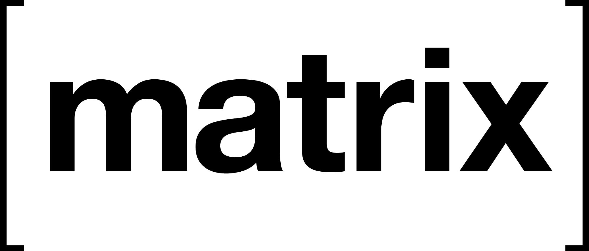

# <!-- .element: class="plain" -->
<!-- .slide: data-background="#417D44" -->

------------------------------------------------------------

# Issues

[<!-- .element: style="height: 370px; margin: -20px;" -->](https://rsf.org/en/ranking)
- Some governments __censor__ online information
- And they can __track website users__

Notes:
- Map is _2018 World press freedom index map_
- light is good, dark is worse
- Belgium is 7th, France is 33th, UK is 40th

## Solutions

- __VPN__: detectable, either paid or hard to set-up, privacy invasive
- __Tor__: detectable
- __Mirror__: depends on foreign entities, can be blocked

------------------------------------------------------------

# <!-- .element: class="plain" -->
### a federated information network
<!-- .slide: data-background="#417D44" -->

## Federated infrastructure

- Built on [<!-- .element: class="plain" style="height: 60px; margin: 0; vertical-align: middle;" -->](https://matrix.org)
    + Uses HTTPS (encrypted and harder to track)
    + Data is synchronised across the federation
    + Each server keeps a copy of all data sent
- Anybody can host a node
- The list of nodes is public

Notes:
- If the node goes down, users can switch to another known node
- __=> Anybody can send deceptive information__

## RSS-like

<!-- .element: style="height: 370px; margin: -20px;" -->

- Subscribe to information sources
- Read articles

## Self-regulated

- Users can build a trust network with:
    + Trusted information sources
    + Trusted NGOs
- Inspired by liquid democracy

## End-to-end signing

- Like E2E encryption, but without encryption
- Ensure information haven't been tampered with

------------------------------------------------------------

## Current status

<!-- .element: class="plain" style="height: 400px;" -->

Notes:
- Two people working on their free time
- CF hackathon organised by RWB & La Cantine Brestoise
- POC revealed some design limitations

------------------------------------------------------------

# Thanks!
<!-- .slide: data-background="#417D44" -->

- [__Github__: <u>https://github.com/informo</u>](https://github.com/informo)
- [__Read the specs__: <u>https://specs.informo.network</u>](https://specs.informo.network/)
- [__IRC__: `#informo` on chat.freenode.net](irc://chat.freenode.net/#informo)
- [__Matrix__: `#discuss:weu.informo.network`](https://matrix.to/#/!LppXGlMuWgaYNuljUr:weu.informo.network)
- __Mail__: <core@informo.network>

__Please come and contribute!__
