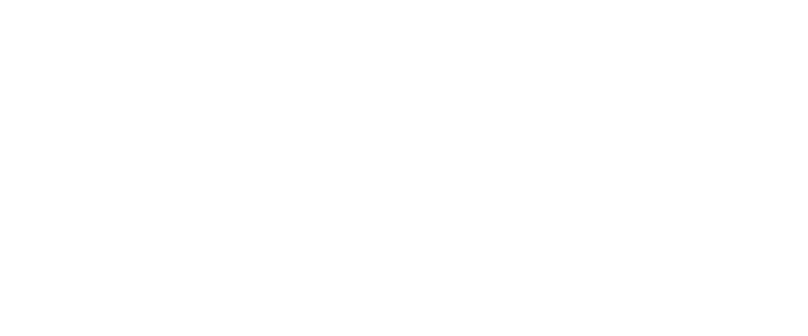
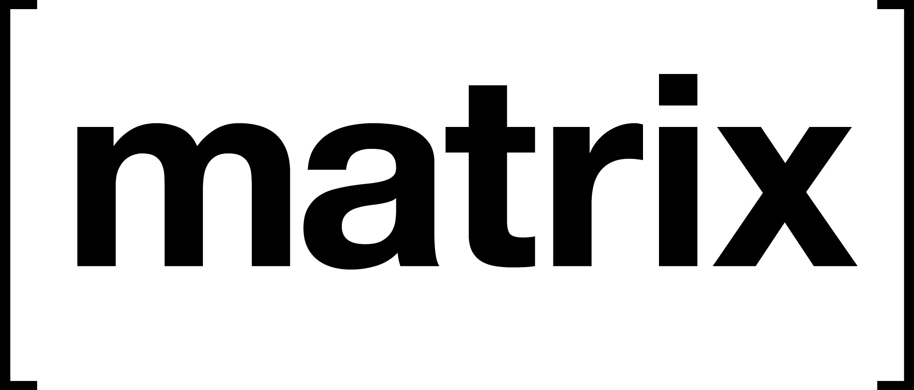

# <!-- .element: class="plain" -->
<!-- .slide: data-background="#417D44" -->

## Who we are

- Vabd
    + Matrix `@vabd:weu.informo.network`
    + Mail `vabd@informo.network`
    + GPG `EA4BC86670028E3B26DD613D3972AC25F549D254`<!-- .element: style="font-size: 0.7em" -->
- GordonF
    + Matrix `@gordonf:weu.informo.network`
    + Mail `gordonf@informo.network`
    + GPG `12D7F3CE28D13F10C8B6D12ADA220606B48CF8E5`<!-- .element: style="font-size: 0.7em" -->

------------------------------------------------------------

# Issues

- Some countries censor information and journalists
- Governments or ISPs can track who visits specific websites

## Solution: proxy / mirror

- Users rely on foreign entities to set them up
- They can be blocked too

Note: Tor uses a specific protocol that can be detected

## Solution: VPN

- VPN traffic is easily detected
- Privacy invasive
- Either costly or hard to set-up

## Solution: Tor

- Tor traffic is easily detected

Note: Tor uses a specific protocol that can be detected

------------------------------------------------------------

# Informo
<!-- .slide: data-background="#417D44" -->

### a decentralised information network

## Federated infrastructure

- Built on [<!-- .element: class="plain" style="height: 60px; margin: 0; vertical-align: middle;" -->](https://matrix.org)
    + Hides users' IP
    + Uses HTTPS (harder to track)
    + Data is synchronised across the federation
    + Each server keeps a copy of all data sent
- Anybody can host a node
- We can keep track of existing nodes

Notes: 
- User's IP is only known by user's entrypoint
- __=> Anybody can send deceptive information__

## Trust management

- Organizations can share lists of:
    + Trusted journalists
    + Trusted organizations
    + Trusted nodes
- User can trust
    + On per-entity basis
    + An organisation and its trusted entities

Notes:
- Similar to delegative / liquid democracy

## End-to-end signing

- Like E2E encryption, but without encryption
- Traffic between client and nodes is already encrypted (HTTPS)
- Ensure an article hasn't been tampered with

------------------------------------------------------------

## Current status

- Started in Dec. 2017 during Collateral Freedom hackathon
- Proof of concept
- Open specifications since Oct. 2018

Notes:
- POC revealed some design limitations

------------------------------------------------------------

# Thanks!
<!-- .slide: data-background="#417D44" -->

- [__Github__: <u>https://github.com/informo</u>](https://github.com/informo)
- [__Read the specs__: <u>https://specs.informo.network</u>](https://specs.informo.network/)
- [__IRC__: `#informo` on chat.freenode.net](irc://chat.freenode.net/#informo)
- [__Matrix__: `#discuss:weu.informo.network`](https://matrix.to/#/!LppXGlMuWgaYNuljUr:weu.informo.network)
- [__Mail__: core@informo.network](core@informo.network)

__Please come and contribute!__
